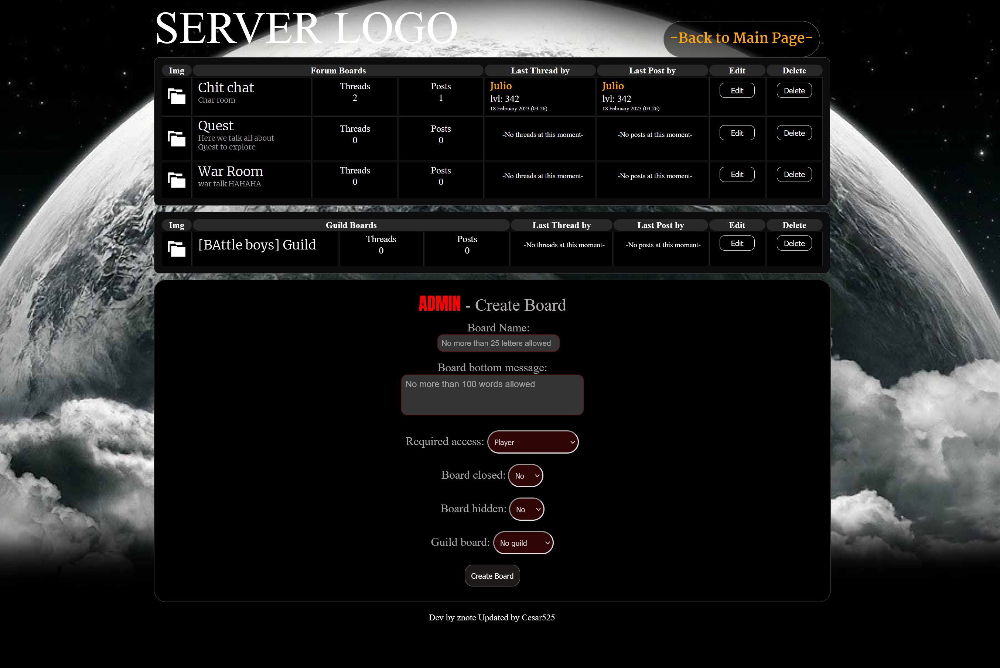
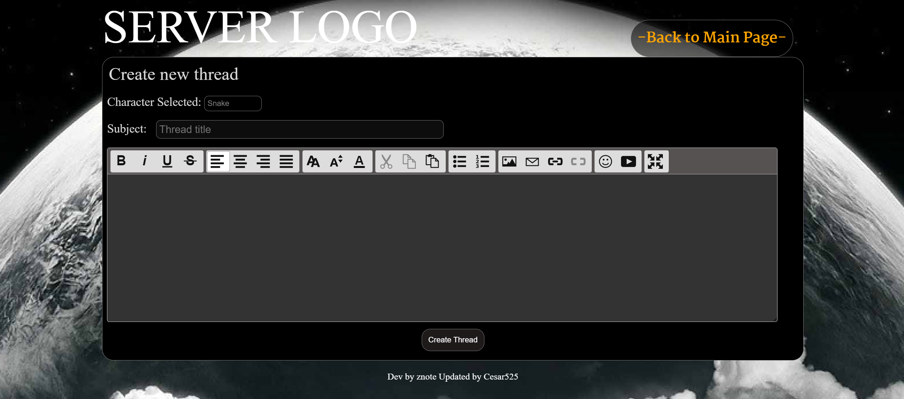

# Znote_forum_byCesar525
This is a Znote Forum Updated by Me.
This is a open project to contribute with [Otland](https://otland.net/) community.

# installation
1) Make sure you have all Znote SQl data table installed
2) Go to cesar525 folder and add the sql_schema.sql file to the database also.
3) Copy and pasted these file to the htdocs folder if you using xampp or pass the files to the project page folder.
and DONE...

REMEBER --- every change if you want the forum to show counting post or not is made at the cesar525_forum_config.php file inside the cesar525 folder.

# Thanks to & Credits -
* [Znote](https://github.com/Znote/ZnoteAAC) for building this Open source website
* [Sceditor](https://www.sceditor.com/) for giving us a Free open open source editor (This version is edited by me also. so you wont find it at the web.)

# Message to Developers.
I didn't put any of the tags on the CSS. This was all done my classes so my editing doesn't affect yours. 

# Donation for upcomming updates

* Add replies post with alert of replies.
* Add upload avatar for each account
* Add pagination to post and and threads
* Add reaction button to post
* Add 20 more emojis on sceditor.
* Add Level under the avatar on posts ( set it up optional on/off )
* add HOT Topic after topic reaches over 100 posts. ( the 100 will be 
optional which it means you will be able to change to to higher number in 
the configuration.)
* Update Forum Search

Contact and Support me at my Website [Dev Let's Work Together](https://devletswork.com/)

# images

# License
* 
